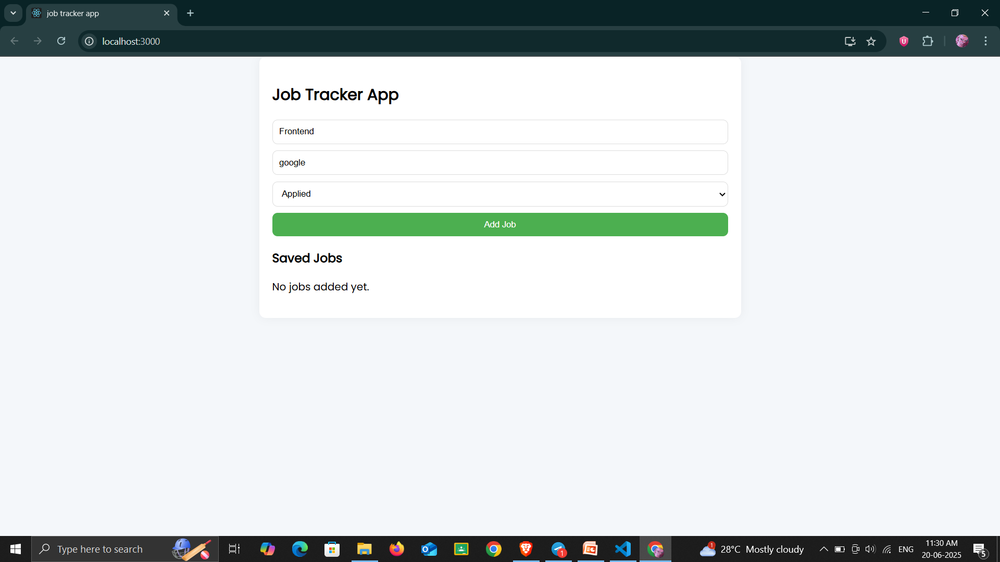
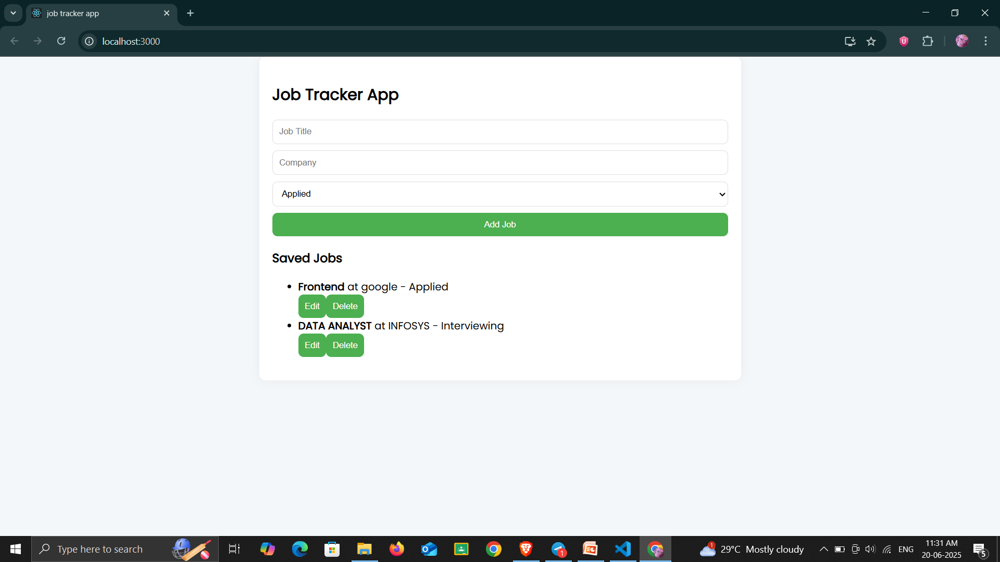

# 🧾 Job Tracker Web App

A simple and responsive job application tracker built using **React.js**.  
This app helps you manage your job applications by allowing you to **add**, **edit**, **delete**, and **track** jobs easily

---

## 🚀 Features

- 📥 Add new job applications
- ✏️ Edit existing job details
- ❌ Delete jobs no longer needed
- 📱 Mobile-responsive layout with polished UI

---

## 🛠️ Tech Stack

- **Frontend:** React.js, JavaScript, HTML, CSS
- **State Management:** useState, Props
- **Tools Used:** VS Code, Git, GitHub

---

## 📸 Screenshots

### 🔹 Add Job Form


### 🔹 Job List with Edit/Delete


> *(Tip: Save your screenshots in a folder named `/assets` inside the repo and update the image links above)*

---

## 📦 How to Run Locally

```bash
git clone https://github.com/blank-port/job-tracker-app.git
cd job-tracker-app
npm install
npm start
